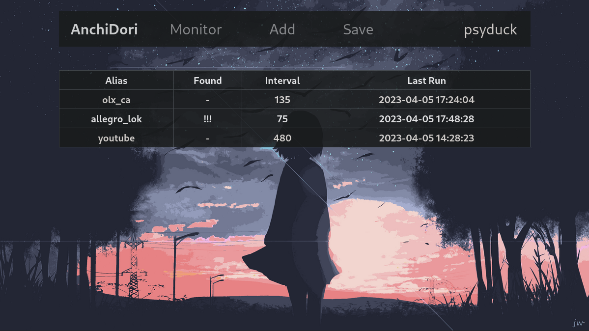
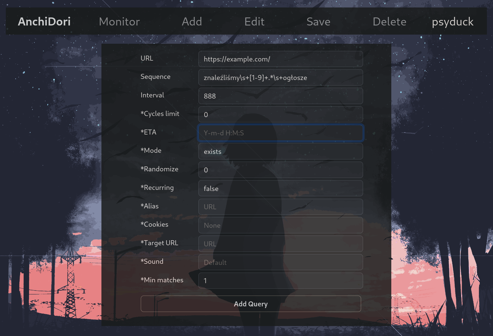
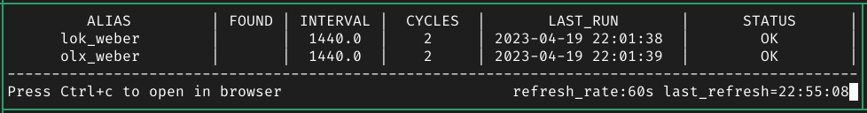

<h1>AnchiDori - Webpage Monitor</h1>

Built in a client-server architecture, AnchiDori automates the webpage monitoring by employing customizable queries. 

<h1>Backend Server</h1>
An asynchronous https server handling all the background work. It handles user sessions, ongoing requests and overall query management. For initial login, user provides their master password, however for the following requests, a session-token is used. If user logs in again, their session will be restored. A UserManager is used to separate users session from each another. Then each user has their own Monitor object assigned, which is used for all operations related to queries - add, edit, delete, load from DB. The Query object consists of multiple parameters that influence scheduling behaviour or a sound played on found, etc. For each user's query, there is a Query object that actually makes connection to the url and searches for a given sequence. The queries are scheduled (and ran) simultaneously by the Monitor using ThreadPoolExecutor, which greatly reduces time. 

<h1>Reactjs Frontend</h1>

Web interface written in React. Offers a somehow more user-friendly experience with the App. This allows user to view nicely formatted Monitor table, effortlessly add, edit or delete Queries with auto prefilled forms. 

<h1>Command Line Interface</h1>

Text based interface that nevertheless offers a complete functionality - dynamically displaying the Query Monitor, managing queries (add, edit, delete), opening the target url in the browser and playing notifications. It's used mainly for debugging, however it offers some additional benefits compared to the browser solution such as: notification cache, gathering session-cookies, no additional dependencies.

<h1>Query:</h1>
<ol>
<li>url - url at which the requests will be made</li>
<li>target_url - url at which the user will be directed if a query finds the match</li>
<li>sequence - a string of characters that the query will be looking for. Supports regex and multiple sequences</li>
<li>interval - base time (in minutes) between requests</li>
<li>randomize - factor for randomization of time between requests (0-100)</li>
<li>eta - estimated time of arrival. Adjusts interval based on predicted date when the content is supposed to appear</li>
<li>mode - defines if a query should look for a match or conversly: if a sequence is no longer available</li>
<li>cycles_limit - limits the amount of requests made for that query</li>
<li>cycles - counts how many cycles has been run</li>
<li>last_run - date of last successful request</li>
<li>found - whenever a sequence was matched (takes into account 'mode')</li>
<li>is_recurring - should query continue to run after a match was found</li>
<li>cookies_filename - where the server should look for the session cookies (remediates the need for a manual login)</li>
<li>alias - abbreviation for a query. Used for presentation</li>
<li>alert_sound - name of a sound file that will be played once a match is made. Files are stored on the server and can be downloaded and cached by the client</li>
<li>last_match_datetime</li>
<li>is_new - for recurring queries, if anothes match is made it should be treated as a completely new one</li>
<li>min_matches - minimum number of the sequence occurences that must occur in order for the query to match</li>
<li>status - indicates whenether query ran successfuly or stumbled upon some issues</li>
</ol>

<h1>ToDo</h1>
<ol>
<li>Implement a SQL database</li>
<li>Update README</li>
<li>add functional tests for the backend server</li>
<li>Cookies should be fetched by client and sent to the server</li>
<li>Frontend: add https</li>
<li>...</li>
</ol>