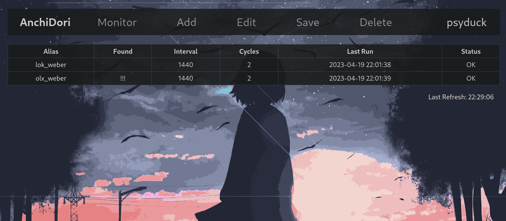

<h1>AnchiDori - Webpage Monitor</h1>

Built in a client-server architecture, AnchiDori automates the webpage monitoring by employing customizable queries. 

<h1>Backend Server</h1>
An asynchronous https server handling all the background work. It manages user sessions, ongoing requests and overall query management. Each user has their own set of queries stored in a database and once logged, their data will be kept in a Session Manager. In order to monitor a webpage periodically, the client-side must repeat the requests (i.e. refresh interval) to the backend server, and the latter will check if any query matches conditions to be run (effectively schedules the queries). A response is returned each time and it's on the side of the client to react accordingly based on 'found' and 'is_new'. When scanning, all the queries are run simultaneously thanks to ThreadPoolExecutor.

Query:

<ol>
<li>url - url at which the requests will be made</li>
<li>target_url - url at which the user will be directed if a query finds the match</li>
<li>sequence - a string of characters that the query will be looking for. Supports regex and multiple sequences</li>
<li>interval - base time (in minutes) between requests</li>
<li>randomize - factor for randomization of time between requests (0-100)</li>
<li>eta - estimated time of arrival. Adjusts interval based on predicted date when the content is supposed to appear</li>
<li>mode - defines if a query should look for a match or conversly: if a sequence is no longer available</li>
<li>cycles_limit - limits the amount of requests made for that query</li>
<li>cycles - counts how many cycles has been run</li>
<li>last_run - date of last successful request</li>
<li>found - whenever a sequence was matched (takes into account 'mode')</li>
<li>is_recurring - should query continue to run after a match was found</li>
<li>cookies_filename - where the server should look for the session cookies (remediates the need for a manual login)</li>
<li>alias - abbreviation for a query. Used for presentation</li>
<li>local_sound - name of a sound file that will be played once a match is made</li>
<li>last_match_datetime</li>
<li>is_new - for recurring queries, if anothes match is made it should be treated as a completely new one</li>
<li>min_matches - minimum number of the sequence occurences that must occur in order for the query to match</li>
<li>status - indicates whenether query ran successfuly or stumbled upon some issues</li>
</ol>

<h1>Command Line Interface</h1>
A simple, text based interface that nevertheless offers a complete functionality - dynamically displaying the Query Monitor, managing queries (add, edit, delete), opening the target url in the browser and playing notifications. 

<h1>Reactjs Frontend</h1>
Not yet working but looks amazing so far :)

<h1>ToDo</h1>
<ol>
<li>Implement a SQL database</li>
<li>Complete Reactjs frontend</li>
<li>Cookies should be fethed by client and sent to the server</li>
KeyError: 'username'</li>
<li>...</li>
</ol>